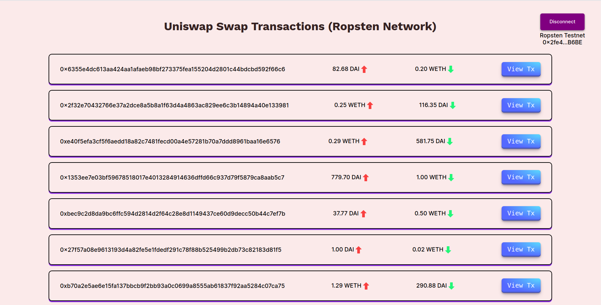

# Frontend - React App

Create a **.env** file similar to **.env.example**


## Commands

- To start the app -

```bash
  npm run start
```
Application will be accessible at http://localhost:3000

Once you are on the main page, connect to the metamask wallet and switch to **Ropsten** network to fetch the `Swap` event logs.


## Screenshots

;